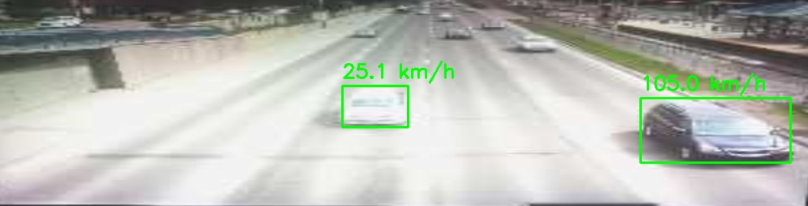

# 🚗 Real-Time Car Speed Tracking System

### 👨‍🎓 Team Members

- 23L-0564
- 23L-0804
- 23L-0965

---

<p align="center">
  
</p>

A real-time vehicle speed tracking system built using **React Native (Expo)** and **Flask** that estimates vehicle speed using computer vision techniques such as **YOLO object detection**, **homography transformation**, and **bird’s-eye view projection**.

The mobile frontend continuously streams video frames to the backend, where cars are detected and tracked in real time. The backend calculates the vehicle speed based on transformed spatial distance between consecutive frames and sends the speed readings back to the frontend for live visualization.

---

# 📌 Features

- Real-time frame streaming from mobile device
- Vehicle detection using YOLO
- Consecutive frame comparison
- Homography mapping between frames
- Bird’s-eye view transformation
- Pixel-to-distance conversion
- Real-time speed estimation
- Live speed overlay on detected vehicles
- React Native (Expo) frontend
- Flask backend API

---

# 🧠 How It Works

## 1. Frame Capture

The React Native application captures video frames continuously using the device camera.

These frames are sent to the Flask backend in real time.

---

## 2. Vehicle Detection

The backend uses **YOLO** to detect vehicles in each incoming frame.

Detected cars are localized using bounding boxes.

---

## 3. Frame Matching

For every vehicle:

- Previous frame
- Current frame

are compared to determine movement.

---

## 4. Homography Transformation

Both frames are mapped using **homography transformation** to align perspective distortion.

This allows accurate spatial comparison between frames.

---

## 5. Bird’s-Eye View Conversion

The transformed frames are converted into a **bird’s-eye view** representation.

This removes perspective bias and allows more reliable distance estimation.

---

## 6. Distance Calculation

The displacement of the detected vehicle between consecutive frames is measured in transformed space.

The system calculates:

- Pixel displacement
- Real-world transformed distance

using calibration and scaling factors.

---

## 7. Speed Estimation

Since the time difference between frames is known:

```python
speed = distance / time
```

Vehicle speed is calculated in real time.

---

## 8. Live Visualization

The calculated speed is sent back to the React Native application and displayed live on top of the detected vehicle.

---

# 🏗️ Tech Stack

## Frontend

- React Native
- Expo
- WebSockets / HTTP Streaming

## Backend

- Flask
- OpenCV
- YOLO
- NumPy

## Computer Vision Techniques

- Object Detection
- Homography Mapping
- Perspective Transformation
- Bird’s-Eye View Projection
- Real-Time Distance Estimation

---

# 📂 Project Structure

```bash
project/
│
├── frontend/              # React Native Expo App
│   ├── components/
│   ├── screens/
│   └── services/
│
├── backend/               # Flask Backend
│   ├── models/
│   ├── routes/
│   ├── utils/
│   └── app.py
│
└── README.md
```

---

# ⚙️ Installation

# 1️⃣ Clone Repository

```bash
git clone https://github.com/yourusername/car-speed-tracker.git

cd car-speed-tracker
```

---

# 2️⃣ Backend Setup

```bash
cd backend

python -m venv venv
```

## Activate Virtual Environment

### Windows

```bash
venv\Scripts\activate
```

### Linux / Mac

```bash
source venv/bin/activate
```

## Install Dependencies

```bash
pip install -r requirements.txt
```

## Run Flask Server

```bash
python app.py
```

---

# 3️⃣ Frontend Setup

```bash
cd frontend

npm install
```

## Start Expo App

```bash
npx expo start
```

---

# 🔄 Real-Time Pipeline

```text
Mobile Camera
      ↓
Frame Capture
      ↓
Send Frames to Flask Backend
      ↓
YOLO Vehicle Detection
      ↓
Homography Mapping
      ↓
Bird’s-Eye Transformation
      ↓
Distance Estimation
      ↓
Speed Calculation
      ↓
Send Speed Data to Frontend
      ↓
Real-Time Overlay Display
```

---

# 📸 Example Output

```text
Car Detected
Speed: 67 km/h
```

Displayed live on top of the detected vehicle in the mobile application.

---

# 🚀 Future Improvements

- Multi-object tracking
- License plate recognition
- Speed violation alerts
- Cloud deployment
- GPU acceleration
- Edge AI optimization
- Lane detection
- Traffic analytics dashboard

---

# 🧪 Challenges Solved

- Perspective distortion handling
- Accurate distance estimation
- Real-time frame processing
- Mobile-to-server streaming optimization
- Homography alignment
- Low latency communication

---

# 📈 Performance Considerations

- Frame compression before transmission
- Async frame processing
- GPU inference support
- Reduced network overhead
- Frame skipping optimization

---

# 🛡️ Use Cases

- Smart traffic systems
- Highway monitoring
- Traffic analytics
- Vehicle speed enforcement
- Intelligent transportation systems

---

# 📄 License

This project is licensed under the MIT License.